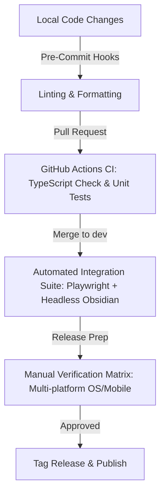

# 🛠 Deep Vault — Internal Build Documentation

This document provides internal guidelines, architecture details, and troubleshooting steps for the build and deployment pipeline of the Deep Vault Obsidian plugin.

---

## 📋 Build Architecture Overview

Deep Vault is structured as an Obsidian plugin developed in **TypeScript** and compiled using **esbuild** for high-speed bundling.

### Key Technologies
- **TypeScript**: Used for robust type-safety and modern JavaScript features.
- **esbuild**: A fast bundler configured to bundle all source code (`src/main.ts`) into a single CommonJS package (`main.js`).
- **NVM (Node Version Manager)**: Used to manage Node.js runtimes safely across environments without requiring root permissions.

---

## ⚡ The `build.sh` Shell Script

A specialized Linux build and deployment automation script (`build.sh`) resides in the project root.

### Core Pipeline
When executed, the script performs the following sequence:

1. **Environment Preparation**: Checks if NVM is installed under `$HOME/.nvm` and sources it automatically to load Node.js and `npm`.
2. **System Verification**: Verifies that `npm` is present in the shell environment. If not, it displays a friendly error and terminates safely.
3. **Dependency Check**: Checks for the existence of the `node_modules` directory. If it is missing, it automatically triggers `npm install` to recover dependencies.
4. **Compilation**: Runs `npm run build` which:
   - Performs a TypeScript type-check check via `tsc -noEmit -skipLibCheck`.
   - Executes the production-mode bundling in `esbuild.config.mjs`.
5. **Deployment (Optional)**: If an Obsidian Vault path is provided as a CLI argument, it creates the plugin directory and deploys the essential files:
   - `main.js` (Compiled code)
   - `manifest.json` (Plugin metadata)
   - `styles.css` (UI styling definitions)

---

## ⚙️ Usage Guide

### Standard Compilation
To build the project and output a production bundle in the root directory:
```bash
./build.sh
```

### Auto-Deployment to Obsidian Vault
To build and immediately copy the output assets to your local Obsidian plugin directory:
```bash
./build.sh /path/to/your/Obsidian/Vault
```
*Note: The script automatically handles creating the `.obsidian/plugins/deep-vault` folder if it does not already exist.*

---

## ⚠️ Troubleshooting & Development Tips

### `Permission denied` when running the script
If the script lacks execution permissions, run:
```bash
chmod +x build.sh
```

### Development (Watch Mode)
For interactive development, where changes automatically trigger quick incremental rebuilds, do not use the production script. Instead, run:
```bash
npm run dev
```
*This configures `esbuild` to watch files and emit inline sourcemaps for debugging.*

### Configuration Files to Know
- **`package.json`**: Defines dependencies and scripts (`dev`, `build`).
- **`esbuild.config.mjs`**: Contains bundling rules, sets the build target (`es2018`), and defines external/excluded modules (e.g. `obsidian`, `electron`, `codemirror`).
- **`tsconfig.json`**: Configures TypeScript compiler choices.

---

## 🧪 Testing & Verification Methodology

Because Obsidian plugins execute within a complex hybrid desktop (Electron) and mobile (Cordova/Capacitor) environment, a comprehensive, multi-tiered testing strategy is required to ensure feature stability.

### Tier 1: Automated Unit Testing (CI/CD Cadence)
**Goal**: Validate non-UI logical units (e.g., utility functions, template variable interpolation, API error handling, tag extraction/normalization).

- **Implementation**: Set up `Vitest` or `Jest` with a mocked Obsidian API wrapper.
- **Cadence**: Execute automatically via a GitHub Actions workflow on every `git push` and Pull Request.
- **Key Modules to Target** *(planned — currently all logic lives in `src/main.ts`; extract these as the codebase grows)*:
  - `src/utils/tag-parser.ts`: Verify that it correctly extracts and structures tag lists.
  - `src/utils/template-engine.ts`: Verify prompt interpolation (`{{date}}`, `{{note_title}}`, etc.).
  - `src/services/claude-client.ts`: Mock Anthropic API responses to verify robust error-handling (rate limits, context window exhaustion).

### Tier 2: Automated Integration Testing (Nightly/Pre-Release Cadence)
**Goal**: Ensure the compiled `main.js` correctly registers commands, initializes views, and interacts with the Obsidian DOM.

- **Implementation**: Run a headless Electron container using `Playwright` that downloads a clean Obsidian build, injects the built plugin into a test vault, and triggers the Obsidian Command Palette.
- **Cadence**: Scheduled nightly test suite and triggered on releases.

### Tier 3: Manual Regression Test Matrix (Pre-Release Checklist)
Before any release (such as merging `dev` → `main`), the following features must be manually verified.

| Feature Area | Test Case | Expected Outcome | Checked |
| :--- | :--- | :--- | :---: |
| **Setup Wizard** | First load with empty settings | Wizard automatically pops up and prompts for API key | [ ] |
| **API Validation** | Input invalid API key | Gracefully handles error, shows intuitive message | [ ] |
| **Research Tab** | Click 'Summarise' card | Fetches and renders a clean 5-bullet summary | [ ] |
| **Chat Tab** | Toggle 'Web Search' on/off | Toggles state; search works and fetches live data | [ ] |
| **Auto-Tag** | Run on sample note | Suggests 5-8 tags, allows selecting/deselecting, writes frontmatter | [ ] |
| **Daily Digest** | Run for 7-day range | Synthesizes a structured digest of recent vault changes | [ ] |
| **Synthesis** | Select 3 research notes | Produces correct comparison/connections output | [ ] |
| **Search Tab** | Perform natural language search | Scores relevance, displays citations with clickable source chips | [ ] |
| **Templates** | Create and execute custom template | Renders perfectly using note variables | [ ] |
| **Mobile Support** | Swipe between tabs on mobile layout | Smooth swipe transitions, correct notch/safe-area spacing | [ ] |

---

## 🔄 Routine Testing Cadence Recommendation



1. **Pre-Commit**: Run `eslint` and `prettier` to keep code syntax consistent.
2. **CI**: Automate type-checking and unit testing with GitHub Actions on every Pull Request.
3. **Pre-Release**: Run the manual verification matrix across Linux/Windows/macOS and Android/iOS simulators before finalizing the GitHub release.

